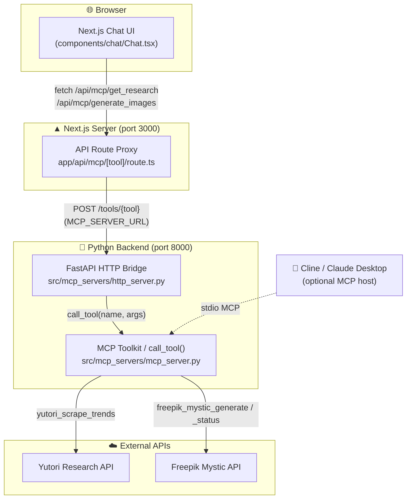

# Content Factory

> **Claude Code for Content Creators** — a chat-first creative studio that researches trending topics, builds a content strategy, and generates on-brand visuals in a single workspace.

Content Factory is an AI content-generation platform. You describe a campaign in plain language, and the system autonomously:

1. **Researches** trending topics in your niche (via the [Yutori](https://yutori.com) Research API).
2. **Strategizes** each trend into a concrete content idea + posting strategy + image prompt.
3. **Generates** matching, social-ready images (via the [Freepik Mystic](https://www.freepik.com/api) image API).

The tools that perform research and image generation are exposed through the **Model Context Protocol (MCP)**, so the exact same toolkit can be driven either by this web app *or* by an MCP-aware agent such as Cline / Claude Desktop.

---

## Table of Contents

- [What It Does — An Example](#what-it-does--an-example)
- [System Architecture](#system-architecture)
- [Tech Stack](#tech-stack)
- [Prerequisites](#prerequisites)
- [Installation](#installation)
- [Configuration (Environment Variables)](#configuration-environment-variables)
- [Running the Project](#running-the-project)
- [Using It as an MCP Server (Cline / Claude Desktop)](#using-it-as-an-mcp-server-cline--claude-desktop)
- [API Reference](#api-reference)
- [MCP Tool Reference](#mcp-tool-reference)
- [Project Structure](#project-structure)
- [Request Lifecycle (End-to-End)](#request-lifecycle-end-to-end)
- [Troubleshooting](#troubleshooting)
- [Roadmap / Notes](#roadmap--notes)

---

## What It Does — An Example

Suppose you run a **sustainable fashion brand** and want a week of content ideas.

1. Open the dashboard and type into the chat box:

   > *"Create a content campaign for a sustainable fashion brand targeting millennial women who care about eco-friendly materials and ethical manufacturing."*

2. Content Factory calls **Yutori** to scrape ~6 trending topics for that niche. Yutori returns structured trends:

   ```json
   {
     "trends": [
       {
         "title": "Circular Fashion Economy",
         "description": "Brands embracing rental and resale models to cut waste.",
         "url": "https://example.com/circular-fashion",
         "relevance_score": 0.95
       }
     ]
   }
   ```

3. Each trend is turned into a `ResearchResult` — a content idea, a strategy line, and an image prompt:

   | Content Idea | Strategy | Image Prompt |
   | --- | --- | --- |
   | Circular Fashion Economy | Brands embracing rental and resale models to cut waste. | Circular Fashion Economy. Brands embracing rental and resale models to cut waste. |

4. The image prompts are sent to **Freepik Mystic**, which generates an image per idea. The app polls Mystic until each image URL is ready, then renders previews in the chat.

5. Click **Generate Final Report** to compile the ideas + visuals into a single Markdown campaign brief you can copy out.

The result: a ready-to-use, trend-backed content plan with matching visuals, produced from one sentence.

---

## System Architecture

Content Factory has **three layers**: a Next.js web frontend, a thin Next.js proxy route, and a Python backend that wraps the MCP toolkit behind an HTTP bridge.



### Layer-by-layer

| Layer | File(s) | Responsibility |
| --- | --- | --- |
| **Frontend (chat UI)** | `app/`, `components/`, `lib/mcpClient.ts` | Collects the campaign prompt, calls the proxy, renders the strategy table + image previews + final report. |
| **Next.js proxy** | `app/api/mcp/[tool]/route.ts` | Whitelists allowed tools (`get_research`, `generate_images`) and forwards requests to the Python backend at `MCP_SERVER_URL`. Keeps API keys server-side and avoids browser CORS issues. |
| **FastAPI HTTP bridge** | `src/mcp_servers/http_server.py` | Exposes `/tools/get_research`, `/tools/generate_images`, `/health`. Contains the "Cline orchestration layer" that sequences Yutori → Freepik and polls for async image results. |
| **MCP toolkit** | `src/mcp_servers/mcp_server.py` | Defines the four MCP tools and the actual HTTP calls to Yutori & Freepik. Runnable as a stdio MCP server *or* imported directly by the bridge. |

> **Why two Python entrypoints?** `mcp_server.py` is the canonical tool implementation. `http_server.py` simply imports its `call_tool()` and exposes it over HTTP so the web app can use it. An MCP-aware agent (Cline, Claude Desktop) can talk to `mcp_server.py` directly over stdio — no HTTP bridge needed.

---

## Tech Stack

**Frontend**
- [Next.js 14](https://nextjs.org) (App Router) + React 18
- TypeScript 5
- Tailwind CSS 3 (+ `@tailwindcss/typography`)
- Framer Motion (animations), Lucide React (icons)
- `react-markdown` + `remark-gfm` (renders strategy tables / reports)

**Backend**
- Python 3.12+
- [`mcp`](https://pypi.org/project/mcp/) — Model Context Protocol server SDK
- [FastAPI](https://fastapi.tiangolo.com) + Uvicorn — HTTP bridge
- [`httpx`](https://www.python-httpx.org) — async HTTP client for the external APIs

**External services**
- **Yutori Research API** — trend scraping (requires API key)
- **Freepik Mystic API** — AI image generation (requires API key)

---

## Prerequisites

Before you can run the project locally, install/obtain the following:

| Requirement | Why | Notes |
| --- | --- | --- |
| **Node.js ≥ 18** | Run the Next.js frontend | `node --version`. Recommended via [nvm](https://github.com/nvm-sh/nvm). |
| **Python ≥ 3.12** | Run the MCP toolkit + HTTP bridge | The repo pins `3.12` (`.python-version`). |
| **`uv`** *(recommended)* | Python dependency + venv management | [Install uv](https://docs.astral.sh/uv/). `pip` works too. |
| **Freepik API key** | Image generation | Get one from the [Freepik API console](https://www.freepik.com/api). |
| **Yutori API key** | Trend research | Get one from [Yutori](https://yutori.com). |
| **npm / pnpm / yarn** | Install JS deps | npm ships with Node. |

---

## Installation

Clone the repo, then install both the JavaScript and Python dependencies.

```bash
git clone <your-repo-url> content-factory
cd content-factory
```

### 1. Frontend dependencies (Node)

```bash
npm install
```

### 2. Backend dependencies (Python)

Using **uv** (recommended — reads `pyproject.toml` / `uv.lock`):

```bash
uv sync
```

Or using **pip** with a virtual environment:

```bash
python3 -m venv .venv
source .venv/bin/activate          # Windows: .venv\Scripts\activate
pip install -r requirements.txt    # mcp, httpx, fastapi, uvicorn
```

---

## Configuration (Environment Variables)

Copy the sample env file and fill in your keys:

```bash
cp env.sample .env
```

`.env` is git-ignored. Required variables:

| Variable | Used by | Description | Example |
| --- | --- | --- | --- |
| `FREEPIK_API_KEY` | Python toolkit | Your Freepik API key | `fpk_live_xxx` |
| `FREEPIK_MYSTIC_URL` | Python toolkit | Freepik Mystic endpoint base URL | `https://api.freepik.com/v1/ai/mystic` |
| `YUTORI_API_KEY` | Python toolkit | Your Yutori API key | `yut_xxx` |
| `YUTORI_API_URL` | Python toolkit | Yutori Research tasks endpoint | `https://api.yutori.com/v1/research/tasks` |
| `MCP_SERVER_URL` | Next.js proxy | Where the proxy forwards tool calls | `http://127.0.0.1:8000` |

Optional tuning (read by `http_server.py` when polling Freepik for async image results):

| Variable | Default | Description |
| --- | --- | --- |
| `MYSTIC_POLL_ATTEMPTS` | `5` | Number of status polls before giving up on an image |
| `MYSTIC_POLL_DELAY_S` | `4` | Seconds between status polls |
| `PORT` | `8000` | Port the FastAPI bridge binds to |
| `ENV` | `dev` | Reported by `/health` |

> **Important:** the Python process must have these variables in its environment. If you use `uv run` / `uvicorn` directly, load `.env` first (e.g. `set -a; source .env; set +a`) or use a tool like `dotenv`. The Next.js process reads `MCP_SERVER_URL` from `.env` automatically.

---

## Running the Project

You need **two processes** running side by side.

### Terminal 1 — Python backend (FastAPI HTTP bridge)

```bash
# load env vars so the toolkit can authenticate
set -a; source .env; set +a

# with uv:
uv run python src/mcp_servers/http_server.py

# or with an activated venv:
python src/mcp_servers/http_server.py
```

This serves on `http://0.0.0.0:8000`. Sanity check:

```bash
curl http://127.0.0.1:8000/health
# {"status":"ok","env":"dev"}
```

### Terminal 2 — Next.js frontend

```bash
npm run dev
```

Open **http://localhost:3000**, click **Go to dashboard**, and start a campaign.

### Smoke-testing the toolkit (optional)

`mcp_server.py` has a built-in Freepik smoke test:

```bash
set -a; source .env; set +a
python src/mcp_servers/mcp_server.py --smoke-test --smoke-poll-attempts 6 --smoke-poll-until-complete
```

This fires a single generation request and polls for the finished image, printing the raw API responses.

---

## Using It as an MCP Server (Cline / Claude Desktop)

The same toolkit can be registered as a stdio MCP server for any MCP host. Add it to your host's MCP config (e.g. Cline's `mcp_config.json` / Claude Desktop's `claude_desktop_config.json`):

```json
{
  "mcpServers": {
    "content-factory": {
      "command": "python",
      "args": ["/absolute/path/to/content-factory/src/mcp_servers/mcp_server.py"],
      "env": {
        "FREEPIK_API_KEY": "your_key",
        "FREEPIK_MYSTIC_URL": "https://api.freepik.com/v1/ai/mystic",
        "YUTORI_API_KEY": "your_key",
        "YUTORI_API_URL": "https://api.yutori.com/v1/research/tasks"
      }
    }
  }
}
```

> The repo's `mcp_config.json` is a template — update the absolute `args` path to your machine and add the API keys. The agent can then call `yutori_scrape_trends`, `yutori_research_status`, `freepik_mystic_generate`, and `freepik_mystic_status` directly.

---

## API Reference

The FastAPI bridge (`http_server.py`) exposes the endpoints the frontend uses. The Next.js proxy maps `/api/mcp/{tool}` → `/tools/{tool}`.

### `POST /tools/get_research`

Scrapes trends and converts them into content ideas.

**Request**
```json
{ "prompt": "sustainable fashion brand for millennial women" }
```

**Response `200`** — array of research results:
```json
[
  {
    "contentIdea": "Circular Fashion Economy",
    "strategy": "Brands embracing rental and resale models to cut waste.",
    "imagePrompt": "Circular Fashion Economy. Brands embracing rental and resale models to cut waste."
  }
]
```

**Errors:** `400` (empty prompt), `502` (no trends returned from Yutori).

### `POST /tools/generate_images`

Generates one image per prompt, polling Freepik until each URL is ready.

**Request**
```json
{ "prompts": ["Circular Fashion Economy. Rental and resale models."] }
```

**Response `200`**
```json
[
  { "url": "https://.../generated.png", "alt": "Circular Fashion Economy. Rental and resale models." }
]
```

**Errors:** `502` (Freepik did not return an image within the poll window).

### `GET /health`

```json
{ "status": "ok", "env": "dev" }
```

---

## MCP Tool Reference

Defined in `src/mcp_servers/mcp_server.py`:

| Tool | Purpose | Key params |
| --- | --- | --- |
| `yutori_scrape_trends` | Start a Yutori research task for a niche; returns structured trends (title, description, url, relevance_score). | `query` *(required)*, `num_results`, `user_timezone`, `user_location`, `webhook_url` |
| `yutori_research_status` | Poll a Yutori research task (`queued` / `running` / `succeeded` / `failed`) and fetch results. | `task_id` *(required)* |
| `freepik_mystic_generate` | Generate an image from a text prompt via Freepik Mystic. | `prompt` *(required)*, `resolution`, `aspect_ratio`, `engine`, `model`, `styling`, `hdr`, … |
| `freepik_mystic_status` | Fetch the status/result of a Mystic generation task. | `task_id` *(required)* |

Both providers are **asynchronous**: a generate/scrape call returns a `task_id`, and you poll the corresponding status tool (or pass a `webhook_url`) until results are ready. The HTTP bridge handles this polling automatically for the web app.

---

## Project Structure

```
content-factory/
├── app/                              # Next.js App Router
│   ├── page.tsx                      # Landing page
│   ├── dashboard/page.tsx            # Dashboard shell (sidebar + chat)
│   ├── layout.tsx                    # Root layout + metadata
│   ├── globals.css                   # Tailwind base styles
│   └── api/mcp/[tool]/route.ts       # Proxy → Python backend
├── components/
│   ├── Sidebar.tsx                   # Session list (static mock)
│   ├── chat/
│   │   ├── Chat.tsx                  # Main chat orchestration + state
│   │   ├── ChatMessage.tsx           # Message bubble
│   │   └── MarkdownRenderer.tsx      # GFM markdown rendering
│   └── ui/Card.tsx                   # Image preview card
├── lib/
│   └── mcpClient.ts                  # Typed client: getResearch / generateImages
├── src/mcp_servers/
│   ├── mcp_server.py                 # MCP toolkit (Yutori + Freepik tools)
│   └── http_server.py                # FastAPI bridge wrapping the toolkit
├── mcp_config.json                   # MCP host config template (Cline/Claude)
├── env.sample                        # Environment variable template
├── pyproject.toml / uv.lock          # Python deps (uv)
├── requirements.txt                  # Python deps (pip)
├── package.json / package-lock.json  # Node deps
├── OVERVIEW.md                       # Original hackathon design doc
└── YUTORI_DOCS.md                    # Yutori API notes
```

---

## Request Lifecycle (End-to-End)

A single "create a campaign" submission flows like this:

```
1. User types a prompt in Chat.tsx and hits Enter.
2. mcpClient.getResearch(prompt)
      → POST /api/mcp/get_research            (Next proxy)
      → POST http://127.0.0.1:8000/tools/get_research   (FastAPI)
      → call_tool("yutori_scrape_trends", { query, num_results: 6 })
      → Yutori Research API
      ← trends[] → mapped to ResearchResult[]
3. mcpClient.generateImages(researchResults.map(r => r.imagePrompt))
      → POST /api/mcp/generate_images
      → POST /tools/generate_images
      → for each prompt:
            call_tool("freepik_mystic_generate", { prompt })
            if no URL yet → poll freepik_mystic_status until ready
      ← GeneratedImage[] (url + alt)
4. Chat.tsx renders a strategy table + image preview cards.
5. (Optional) "Generate Final Report" compiles everything into Markdown.
```

---

## Troubleshooting

| Symptom | Likely cause | Fix |
| --- | --- | --- |
| Chat shows *"I ran into an error reaching the MCP server"* | Python backend not running, or wrong `MCP_SERVER_URL` | Start `http_server.py`; verify `curl /health`; check `.env`. |
| `Missing required env var: FREEPIK_API_KEY` (or YUTORI) | Env vars not loaded into the Python process | `set -a; source .env; set +a` before launching, or export them in the shell / MCP host config. |
| `502 No trends returned from Yutori` | Yutori task returned nothing / still running | Verify the Yutori key + URL; broaden the prompt; the bridge requests a single synchronous result, so transient failures can occur. |
| `502 Freepik did not return an image` | Generation slower than the poll window | Increase `MYSTIC_POLL_ATTEMPTS` / `MYSTIC_POLL_DELAY_S`. |
| Images don't load in the UI | Returned URL expired or blocked | Re-run; check the Freepik response in the backend logs. |
| CORS errors in browser console | Calling the FastAPI bridge directly instead of via the proxy | Always go through `/api/mcp/*`; the bridge already allows all origins for dev. |

---

## Roadmap / Notes

- The `_cline_orchestrate_research` / `_cline_orchestrate_images` functions in `http_server.py` are deliberately structured as an **orchestration layer**. Today they call MCP tools directly; they're designed to be swapped for a real Cline / agent loop later (multi-step planning, retries, fallbacks).
- `OVERVIEW.md` documents the original hackathon vision (a synchronous "describe brand → download ZIP of 7 posts + spreadsheet" flow). The current implementation evolved into an interactive chat studio; treat `OVERVIEW.md` as historical design context rather than current behavior.
- The sidebar sessions and "Login" button are currently static UI placeholders — there is no authentication or persistence layer yet.
- Yutori and Freepik are both async/task-based; consider wiring up the `webhook_url` parameters for production instead of polling.
